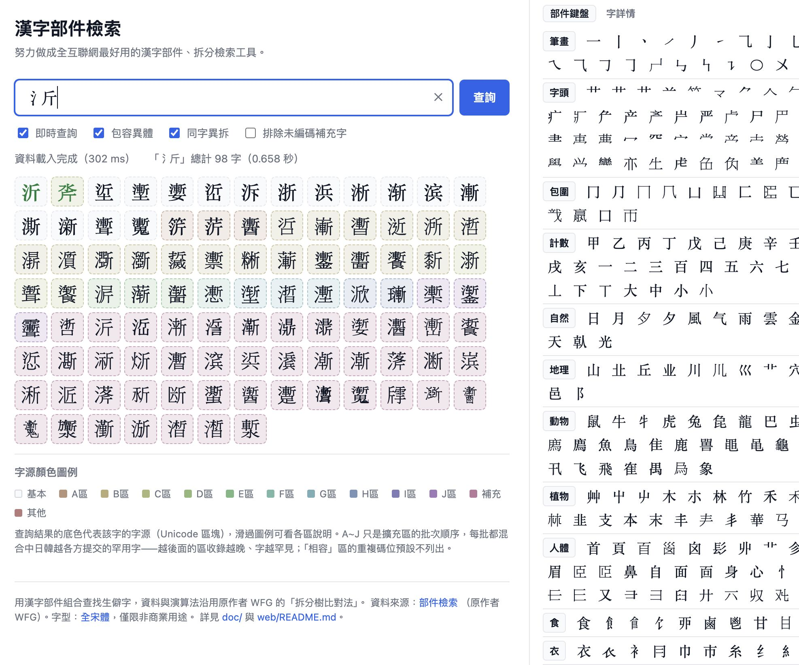
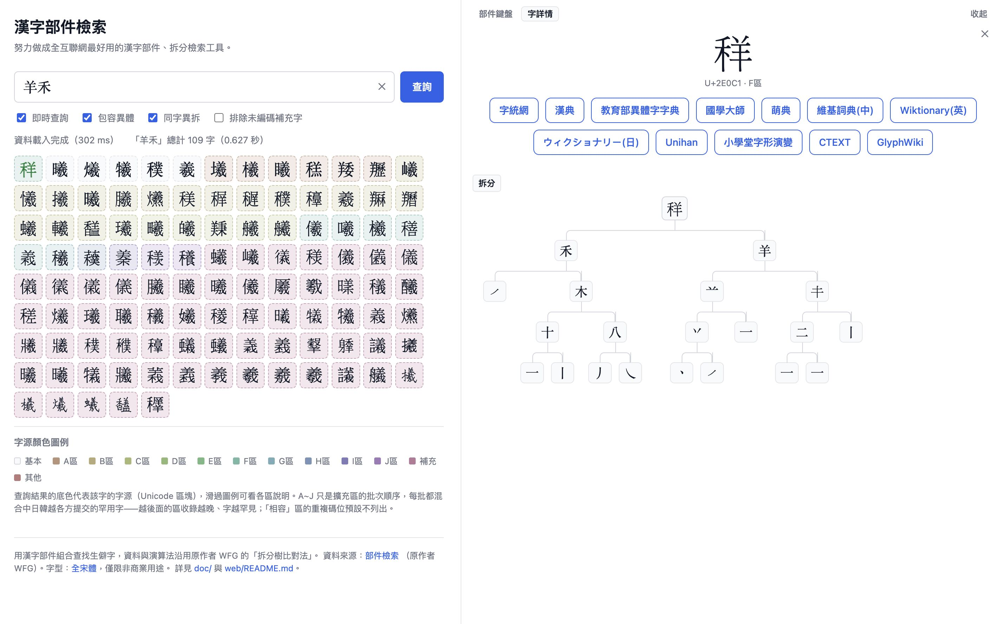

# WFG FSung Webfonts ／ WFG「全宋體」網頁字型

[繁體中文](#繁體中文) · [English](#english)

[](https://hanzi.digitalhumanities.dev/)

[](https://hanzi.digitalhumanities.dev/)

> 實際應用 ／ Live example: [漢字部件檢索](https://hanzi.digitalhumanities.dev/) — a Han character
> component-based lookup tool rendering 200,000+ characters (including all PUA
> supplemental characters) with this webfont package.

---

## 繁體中文

WFG「全宋體」（FSung）的 256 碼位切片 woff2 網頁字型。WFG「全宋體」是一套涵蓋
**20 萬餘漢字**的大型宋體（明朝體）字型，Unicode 尚未編碼的十萬餘「補充字」
以私有造字區（PUA）碼位收錄，由原作者 WFG 個人整理維護，本包對應的版本見其發布公告
「[漢字使用環境的建置——Unicode 17 全宋體更新](https://fgwang.blogspot.com/2025/09/unicode-17.html)」。
它**不是**臺灣官方 CNS11643 標準的「全字庫正宋體」——後者是另一套規模小得多的
官方標準字型；WFG「全宋體」是獨立的個人專案，官方標準字只是其眾多覆蓋範圍之一。

**⚠️ 僅限非商業用途。** 與常見的寬鬆授權 CJK 網頁字型包（OFL/MIT/CC0）不同，
WFG「全宋體」是作者無條件分享給**學術研究、教育工作、個人閱讀**使用的，明確**禁止任何
形式的商業營利行為**。完整條款見 [`LICENSE`](./LICENSE)。

### 使用方式

```html
<link rel="stylesheet" href="./wfg-fsung.css">
```

發布到 npm 後也可以從 unpkg 載入：

```html
<link rel="stylesheet" href="https://unpkg.com/wfg-fsung-webfonts@1.0.1/wfg-fsung.css">
```

```css
body {
  font-family: 'WFG FSung', serif;
}
```

注意：jsDelivr 的 npm 模式有 150MB **整包**大小上限——本包帶齊全部碼位切片
（合計約 163MB），jsDelivr 會對包內**每個**檔案回 403，不只是超大的那幾個。
unpkg 沒有這個限制、可正常服務，請改用 unpkg。

CSS 以 256 碼位為一片的 `unicode-range` 切片（與 `jigmo-webfonts` 等 CJK
網頁字型專案相同的慣例），瀏覽器只會下載頁面實際用到的區塊。

### 字型檔構成

WFG「全宋體」由原作者以七個完整 TTF 檔發布（`FSung-1.ttf`、`FSung-2.ttf`、
`FSung-3.ttf`、`FSung-F.ttf`、`FSung-X.ttf`、`FSung-m.ttf`、`FSung-p.ttf`）。
本包把其中六個合併為單一 CSS 字族，各檔共有的少量 Basic Latin 碼位按優先序
先見先得去重，並帶超集檢查、保證不會默默漏掉任何碼位：

| 來源檔 | 說明 |
|---|---|
| `FSung-2.ttf` | 共用 ASCII 的最高優先序 |
| `FSung-m.ttf` | 以超集身分整塊擁有 Basic Latin 分片（U+0000–00FF） |
| `FSung-3.ttf` | |
| `FSung-F.ttf` | 最大的一檔 |
| `FSung-X.ttf` | |
| `FSung-1.ttf` | |
| `FSung-p.ttf` | **排除**——cmap 與 `FSung-m` 完全重複（皆 40,582 碼位），且原版部件檢索工具自己的 CSS `font-family` 也未引用它 |

分片指派演算法（含 Basic Latin 那一片需要「某來源的覆蓋是否為聯集之超集」
檢查、而非單純先見先得的特例）記錄在產生本包的建置工具旁；本目錄只隨附
生成的 CSS 與 WOFF2 成品、不含建置工具，因此可獨立發布。

- 上游：[漢字使用環境的建置——Unicode 17 全宋體更新](https://fgwang.blogspot.com/2025/09/unicode-17.html)
- 上游版本：2025/09/24 build
- 字型授權：僅限非商業分享——見 [`LICENSE`](./LICENSE)
- 本包詮釋資料（README、package.json）：與字型本身相同的非商業條款，見 [`LICENSE`](./LICENSE)

---

## English

Chunked woff2 webfonts for WFG「全宋體」(FSung), a large Song-style (宋體/明朝體)
font covering **over 200,000 Han characters** — including 100,000+ characters not
yet encoded by Unicode, carried on private-use-area (PUA) codepoints — compiled
and maintained by its author WFG as a personal project. The upstream release this
package was built from is announced in
"[漢字使用環境的建置——Unicode 17 全宋體更新](https://fgwang.blogspot.com/2025/09/unicode-17.html)".
It is **not** the official Taiwan CNS11643「全字庫正宋體」— that is a separate,
much smaller, officially-standardized font; WFG「全宋體」 is an independent personal
project that happens to also cover the CNS-standard characters as a subset.

**⚠️ Non-commercial use only.** Unlike many permissively-licensed CJK webfont
packages (OFL/MIT/CC0), WFG「全宋體」 is shared by its author for academic, educational,
and personal use only — commercial use of any kind is explicitly prohibited.
See [`LICENSE`](./LICENSE) for the full terms.

### Usage

```html
<link rel="stylesheet" href="./wfg-fsung.css">
```

Once published to npm, it can also be loaded from unpkg:

```html
<link rel="stylesheet" href="https://unpkg.com/wfg-fsung-webfonts@1.0.1/wfg-fsung.css">
```

```css
body {
  font-family: 'WFG FSung', serif;
}
```

Note: jsDelivr's npm mode enforces a 150MB *total package* size limit — since this
package bundles every codepoint chunk (~163MB combined), jsDelivr rejects every file
in it with 403, not just the oversized ones. unpkg has no such limit and serves the
package correctly, so use unpkg instead.

The CSS uses 256-codepoint `unicode-range` chunks (the same convention used by
CJK webfont projects like `jigmo-webfonts`), so browsers only download the
blocks a page actually needs.

### Source composition

WFG「全宋體」 is distributed by its author as seven whole TTF files (`FSung-1.ttf`,
`FSung-2.ttf`, `FSung-3.ttf`, `FSung-F.ttf`, `FSung-X.ttf`, `FSung-m.ttf`,
`FSung-p.ttf`). This package combines six of them into one CSS family,
first-seen (priority-order) deduplicated for the small set of Basic Latin
codepoints every shard happens to carry, with a superset check so no
codepoint is silently dropped:

| Source file | Notes |
|---|---|
| `FSung-2.ttf` | highest priority for shared ASCII |
| `FSung-m.ttf` | superset-owns the Basic Latin chunk (U+0000–00FF) |
| `FSung-3.ttf` | |
| `FSung-F.ttf` | largest shard |
| `FSung-X.ttf` | |
| `FSung-1.ttf` | |
| `FSung-p.ttf` | **excluded** — cmap is an exact duplicate of `FSung-m` (both 40,582 codepoints) and it is not referenced by the original 部件檢索 tool's own CSS `font-family` stack |

The chunk-assignment algorithm (including the one Basic Latin chunk that
needed a "does one source's coverage superset the union?" check rather than
plain first-seen dedup) is documented alongside the build tooling that
produced this package; this directory ships only the generated CSS and
WOFF2 output, not that tooling, so it can be published standalone.

- Upstream: [漢字使用環境的建置——Unicode 17 全宋體更新](https://fgwang.blogspot.com/2025/09/unicode-17.html) (2025/09/24 build)
- Font license: non-commercial share only — see [`LICENSE`](./LICENSE)
- Package metadata (this README, package.json): same non-commercial terms as the font itself, see [`LICENSE`](./LICENSE)
